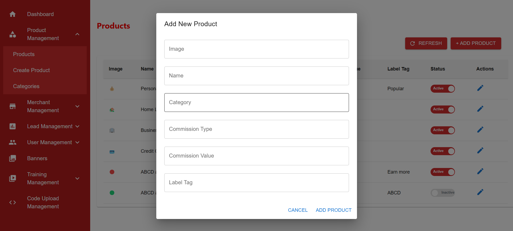
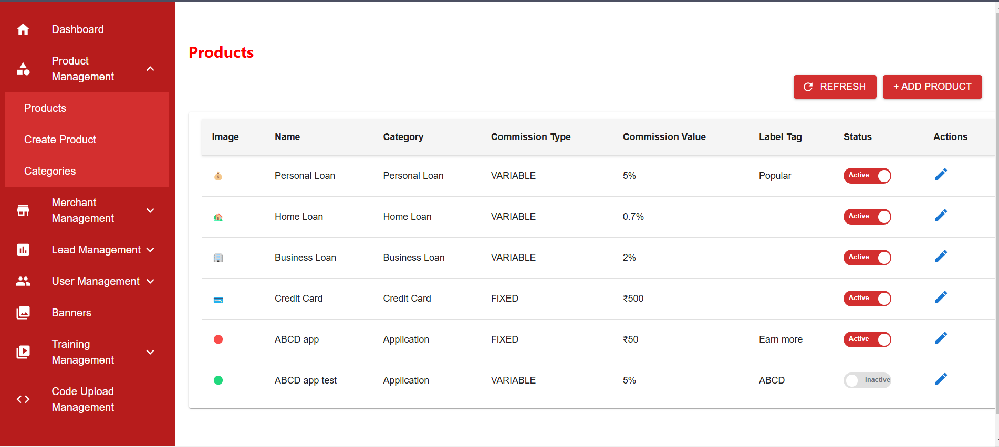

# Kartikey Dashboard

Kartikey Dashboard is a React-based application for managing products. It allows users to view, add, and manage products with details like name, category, commission type, and more.

## Demo

You can view the live demo of the project here: [Kartikey Dashboard](https://kartikey-dashboard-ui.vercel.app/)

## Screenshots

### Screenshot 1:


### Screenshot 2:


## Features

- View product details including image, name, category, commission type, and status.
- Add new products with complete details.
- Toggle product status between active and inactive.

## Getting Started

1. Clone the repository:
   ```bash
   git clone https://github.com/kartikey210900/kartikey-dashboard.git
